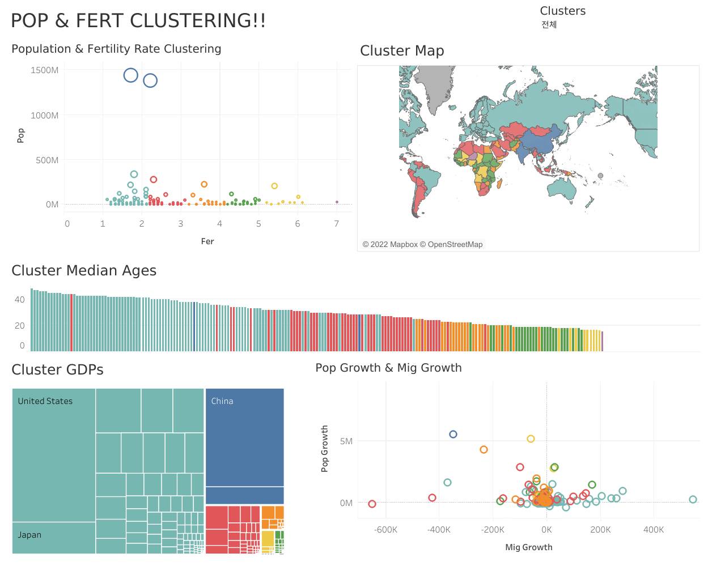

# [Vizable]World Population


## [My Tableau Public Profile](https://public.tableau.com/app/profile/.67511519/)

## [Project Link](https://public.tableau.com/views/VizableWorldPopulation_JH/1_1?:language=ko-KR&:display_count=n&:origin=viz_share_link)


## How it's built

### Data

How To Get Data?

Data Info
```
{
    "path": "/blog",
    "name": "blog",
    "pageTitle": "Blog",
    "pageGroup": "blog",
    "metaDescription": "Read about my latest thoughts and experiences in the world of web development.",
    "controller": "blogs"
}
```

### Concept


### Dashboard Explanation


